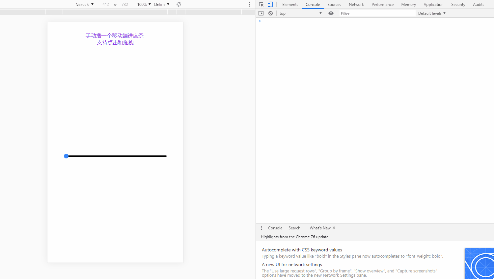

#### 组件使用说明

#### 效果演示


##### step

1. npm install TouchProgress

```js
// 基本用法
import Progress from 'TouchProgress';
export default {
  components: { TouchProgress },
}
```

2. 相关参数

| 参数 | 是否必须  | 参数值 |  默认值 |
|:-----------:| :-------------:| :-------------:| :-------------:| 
| pcocessNumber | 否  | Number | 进度百分比 0 |
| touchBoxStyle | 否  | Object | 进度条的样式 {height: '4px', borderRadius: '2px'} |
| dotStyle | 否  | Object | 圆点的样式 {widht: '14px', height: '14px'}  |
| processStyle | 否  | Object |  进度条背景色的样式 { background: 'rgba(54, 146, 245, 1)' } |

