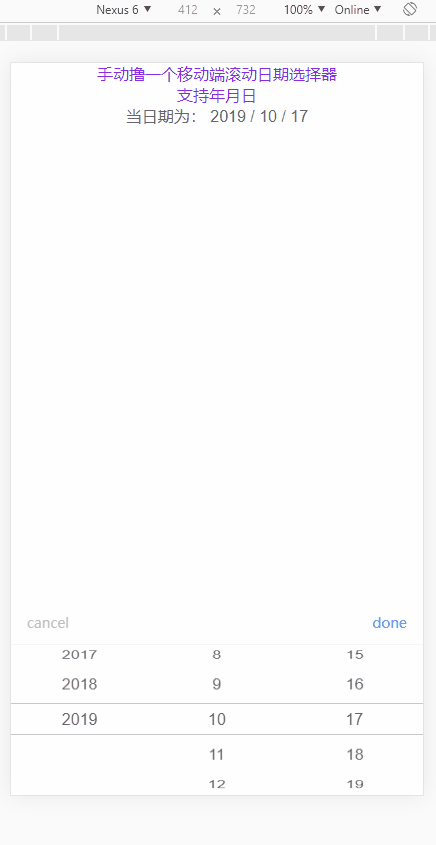

#### 组件使用说明

#### 效果演示


##### step

1. npm install WheelPicker

2. import WheelPicker from 'WheelPicker'

3. 页面引入
```
<template>
  <WheelPicker ref="wheelpicker" @change="change" type="month" :startYear="1950"/>
</template>
```

#### Params

| 参数 | 是否必须  | 参数值 |  默认值 |
|:-----------:| :--------------------------:| :-------------:| :-------------:| 
| textObj | 否  | Object | { cancel: 'cancel', done: 'done' } |
| startYear | 起始年份  | Number | 1950 |
| type | 否  | String (day, month) | day => 年月日选择  month => 年月选择 |
| topStyle | 否  | Object  | { background: 'linear-gradient(180deg, rgba(95, 221, 113, 0.01) 0%, rgba(87, 211, 166, 0.01) 100%)'}  |
| middleStyle | 否  | Object 日期选择器中间部分的背景颜色的样式 | {}  |
| bottomStyle | 否  | Object 日期选择器下半部分的背景颜色的样式 | { background: 'linear-gradient(180deg, rgba(95, 221, 113, 0.01) 0%, rgba(87, 211, 166, 0.01) 100%)'}  |


#### Event

| 事件名 | 是否必须  |
|:-----------:| :--------------------------:|
| change | 点击确认的时候触发, 返回选择的值拼接成的字符串 eg: '2019 / 10 / 15' |
